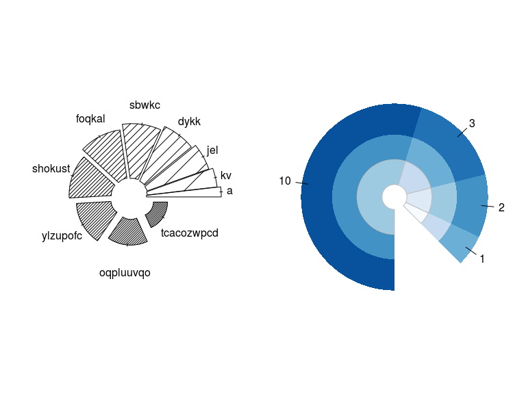

polygons: Flexible functions for computing polygons coordinates in R
================

<!-- README.md is generated from README.Rmd. Please edit that file -->
The goal of polygons is to ...

Example
-------

Here is a basic example of a very controversial type of plot but that anyway can be useful in some situations... the pie chart!:

``` r
library(polygons)

piechart(1:10, density=(1:10)^2/2, slice.off = (1:10)/30, doughnut = .5,
  radius = sqrt(10:1),
  # Here we are setting random labels...
  labels=sapply(1:10, function(x) paste(sample(letters, x, TRUE), collapse=""))
  )
```


