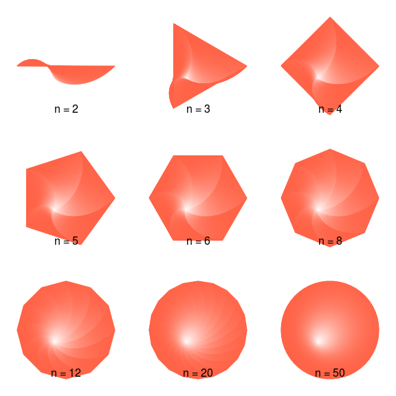

polygons: Flexible functions for computing polygons coordinates in R
================

<!-- README.md is generated from README.Rmd. Please edit that file -->
The goal of polygons is to ...

Example
-------

Here is a basic example of a very controversial type of plot but that anyway can be useful in some situations... the pie chart!:

``` r
library(polygons)

piechart(1:10, density=(1:10)^2/2, slice.off = (1:10)/30, doughnut = .5,
  radius = sqrt(10:1),
  # Here we are setting random labels...
  labels=sapply(1:10, function(x) paste(sample(letters, x, TRUE), collapse=""))
  )
```


Nice n-sided polygons with the `npolygon` function:

``` r
oldpar <- par(no.readonly = TRUE)

par(xpd = NA, mfrow = c(3, 3), mai = rep(0, 4))
for (n in c(2, 3, 4, 5, 6, 8, 12, 20, 50)) {

  plot.new()
  plot.window(c(-1.25,1.25), c(-1.25,1.25))

  # We loop through this sequence to generate a nice decay of colors
  for (i in seq(1, .0005, length.out = 200)) {
    col <- adjustcolor("tomato", alpha.f = i)
    
    # After calling npolygon, we call polygon to draw it
    polygon(npolygon(x=(i-1)/4, y = (i-1)/4, r = i, d = i-1, n = n),
            col = NA, border=col)
  }

  mtext(sprintf("n = %i", n), side = 1, line = -3)
}
```



``` r

par(oldpar)
```
